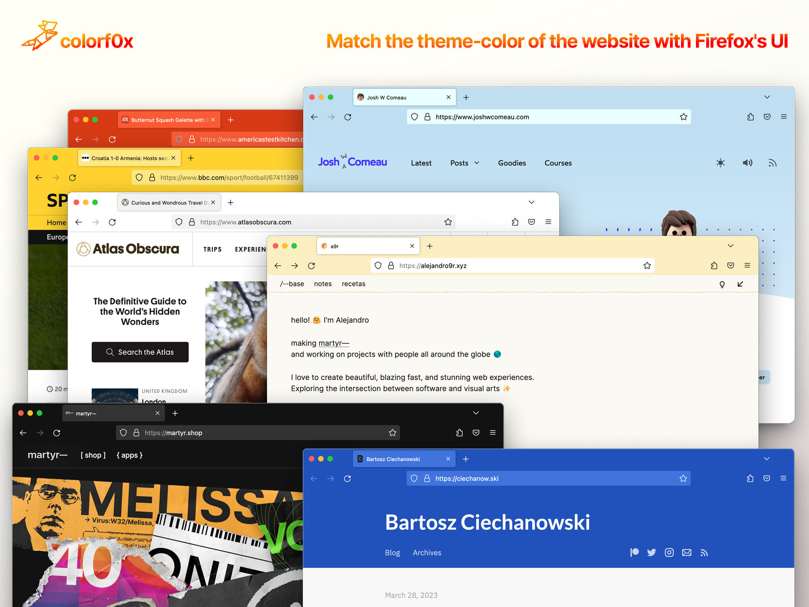

# colorf0x

Match the `theme-color` of the website with Firefox's UI

This is how [Safari 15](https://css-tricks.com/safari-15-new-ui-theme-colors-and-a-css-tricks-cameo/) and toolbars on mobile browsers behave.

Highly inspired by [Adaptive Tab Bar Colour](https://github.com/easonwong-de/Adaptive-Tab-Bar-Colour/). Part of the code has been taken from it. The main differences:

- A cleaner codebase with less features
- Colors in URL bars, active tabs, text color, etc are handled differently. Better contrast and readability. **Very similar to how Chrome for Android does it**.
- Reacts only to `theme-color` values from the website. It doesn't have the dynamic color algorithm that tries to match the website's header or background color that Adaptive Tab Bar Colour has.
- No settings per website. No toggles. Just install and forget

Compatible with [Dark Reader](https://darkreader.org/) 🤗

Thanks to [Eason Wong](https://github.com/easonwong-de) for its work with [Adaptive Tab Bar Colour](https://github.com/easonwong-de/Adaptive-Tab-Bar-Colour/)!

And also:
- [chroma.js](https://gka.github.io/chroma.js/) – a library to manipulate and convert colors

